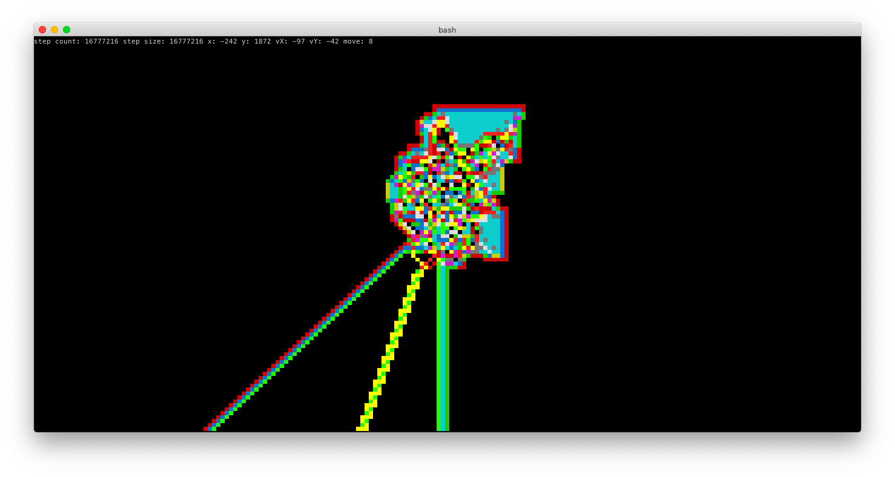

# langton, a *blazingly fast* CLI langton's ant stimulator written in c++
## Installation (unix-like systems)
```bash
git clone https://github.com/lomnom/langton
cd langton
git clone https://github.com/lomnom/nncurses
g++ -std=c++2a -O3 langton.cpp -o langton
sudo cp langton /usr/local/bin/langton
cd ..
rm -rf langton
```
## Uninstallation (unix-like systems)
```bash
rm /usr/local/bin/langton
```
## Usage
run langton's ant by providing rules as arguments!  

### Running
  - `langton RRLLLRLLLRRR`
  - `langton LRRRRRLLR`  

### Controlling
  - q: quit
  - w,a,s,d: move
  - f: move twice as slowly
  - g: move twice as fast
  - c: step the ant
  - e: step half as much
  - r: step twice as much

## Screenshot
  
16 million steps of LRRRRRLLR stimulated in under 3 seconds.
  
RRLLLRLLLRRR

## TODO
Find a way to use less memory, memory usage after 67 million steps of RRLLLRLLLRRR is 324 mb.  
Find a way to step faster.  
Increase contrast of info text
